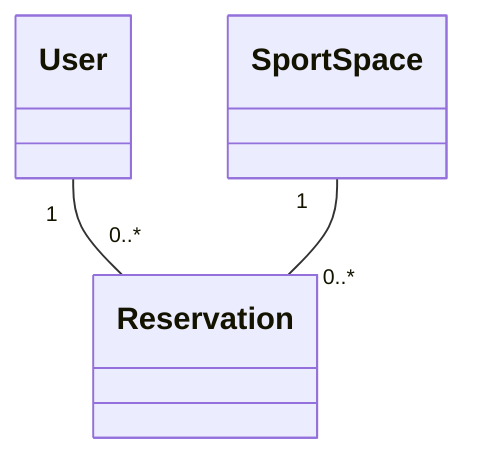

Proyecto de Reserva de Espacios. Requisitos: .NET 8, MySQL. Ejecutar dotnet ef database update para configurar base de datos.

Diagrama de clases (Mermaid):

```mermaid
classDiagram
    User "1" -- "0..*" Reservation
    SportSpace "1" -- "0..*" Reservation
```
